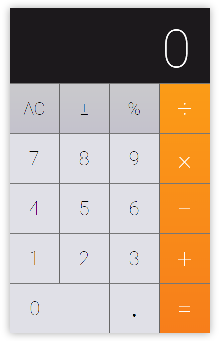

### Create a calculator app using React 🚀
---

---
### Requirements:
- your app should have at least several components (e.x. `Button`, `Panel`, etc.), which will be reusable (they should have independent interface);
- input values could be entered with a keyboard;
- calculator should validate only numbers and special keys as `*`, `/`, `-`, `+` and others;
- take a look at javascript gaps (`0.1 + 0.2` should return `0.3` value);
- feel free to use helper libraries for styling ([`styled-components`](https://www.styled-components.com/), [`react-bootstrap`](https://react-bootstrap.github.io/) and others);
- use only ES6+ syntax! ;