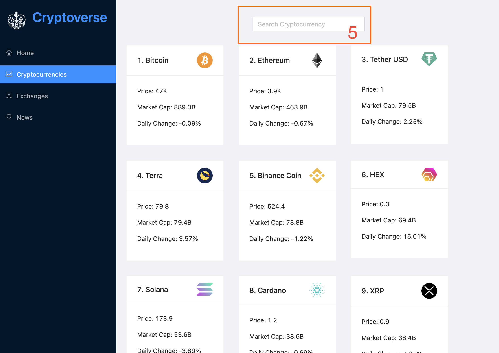

## Create CryptoWorld App using React & TypeScript

---

**API которые понадобятся для реализации**

- ⭐ RapidAPI - https://rapidapi.com/hub
- ⭐ CoinRanking API - https://rapidapi.com/Coinranking/api/coinranking1
- ⭐ Bing News Search - https://rapidapi.com/microsoft-azure-org-microsoft-cognitive-services/api/bing-news-search1/

---

### Main page

- (1) Панель навигации. Переход по роутам (react-router).
- (2) Панель статистики. (`https://coinranking1.p.rapidapi.com/coins` -> `stats`)
- (3) Таблица монет (показаны первых 10 в списке). Целиком таблица показывается по отдельному роуту `Cryptocurrencies` при клике кнопки `Show more`
- (4) Карточка монеты. При клике на карточку - переход на роут с инфо по конкретной монете, ниже будет описание страницы ⬇️

### Cryptocurrencies

Таблица монет.

- (5) Фильтр по названию монеты
