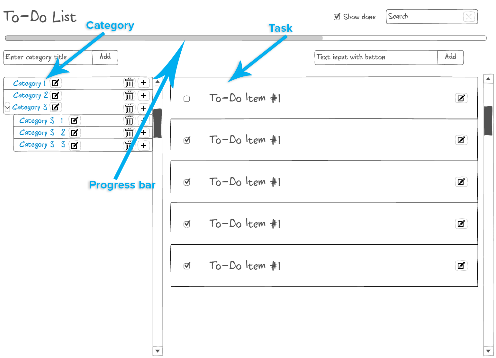
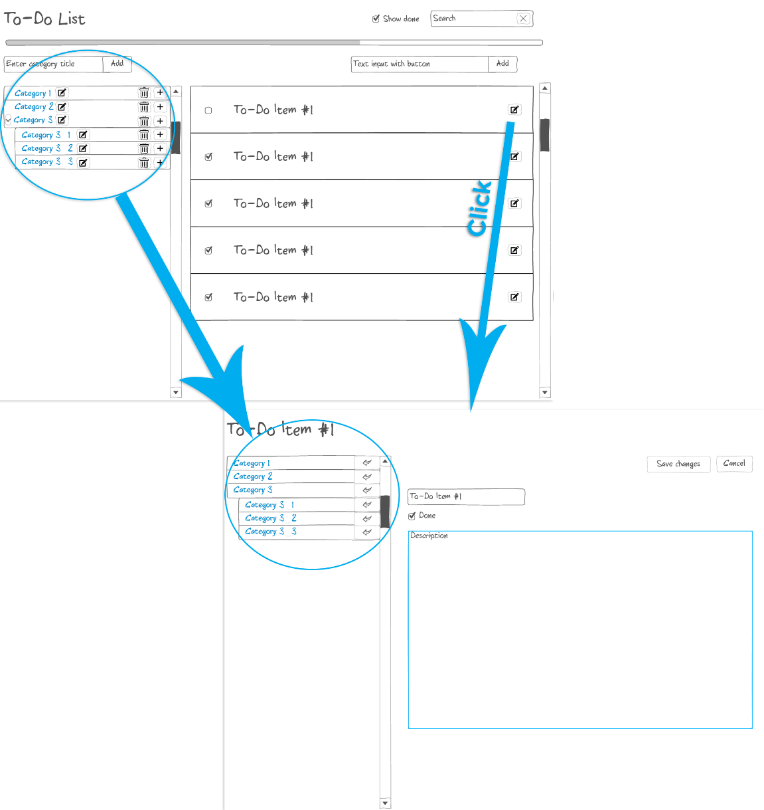
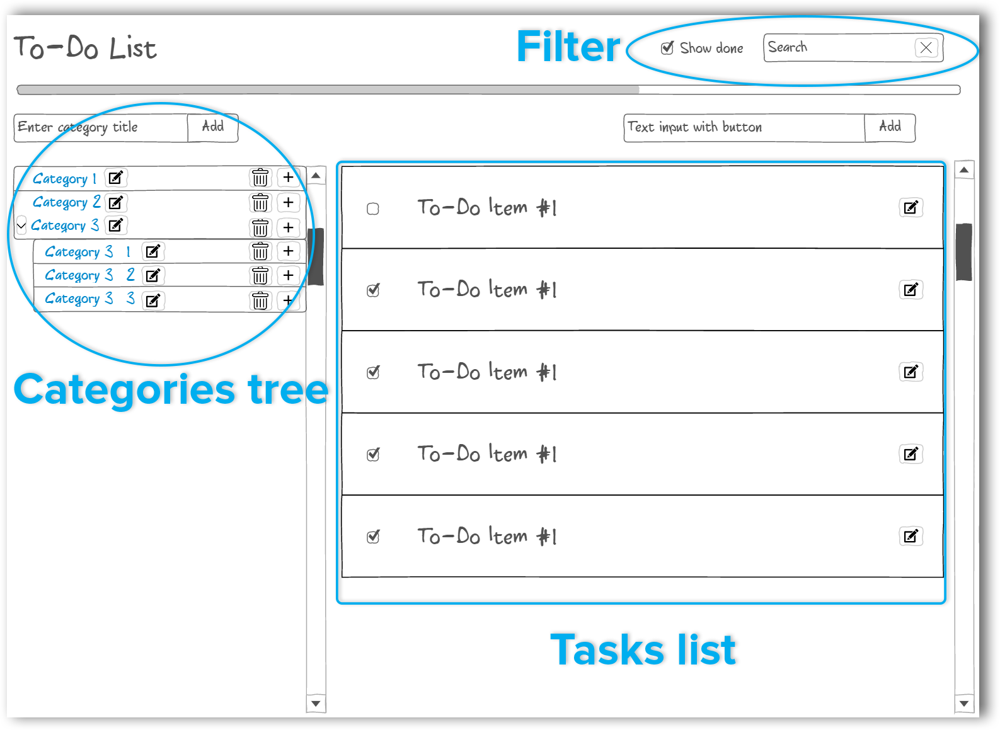

### Create a Todo App using React
---

- Each category has its own list of tasks and shows only them (when a category is selected);
- Each category could have nested category;
- Selected category should be highlighted, a section with todos should be shown at the right;
- If no category is selected hide right section with todos input;
- There should be a possibility to edit selected todo: 
- implement `Save changes` and `Cancel` buttons when edit todo;
- implement a `filter` bar with possibility to show only `done` todos and possibility to search a todo by name: 
- implement a progress bar at the bottom of app header (it should show a progress of todos which marked as done);
---
- use redux to store your data;
- use react-router to handle ui state while clicking on category or a particular todo;