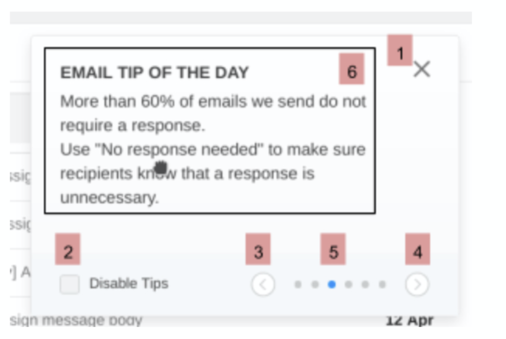

# Создаём свой компонент
## Notifications 🔔

__Напишите скрипт, который динамически будет создавать и подключать компонент нотификаций к любому приложению:__

В качестве данных можете использовать следующий мок - [mocked data](./MOCK_DATA.json).

Component must contain the following elements:

* (1) Closing icon. Click on it closes the component.
* (2) Checkbox that disables notification and sets a flag into local storage. If the flag is set, component won't be shown when the page reloads.
* Arrows (3) and (4) that switch the contents of element (6) to the previous and the next notification respectively.
* (5) Notification number that shows current notification position.
* Keyboard support. Component supports keyboard control: switching back and forward, closing by clicking on the cross.

