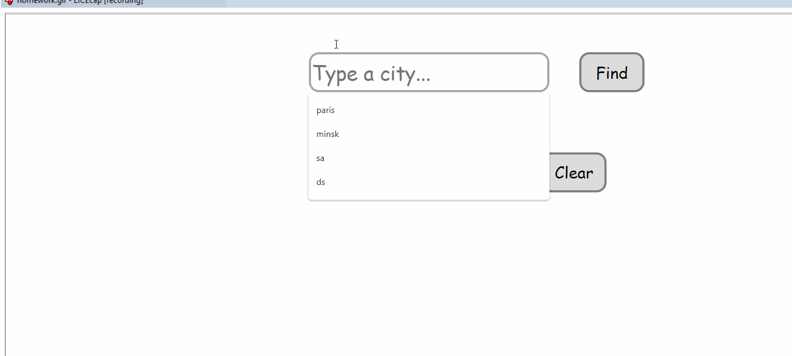
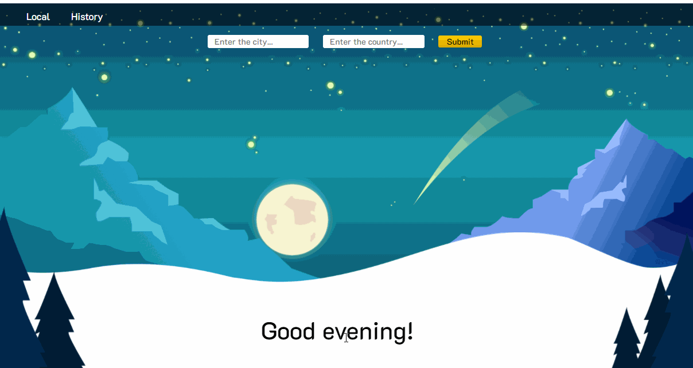
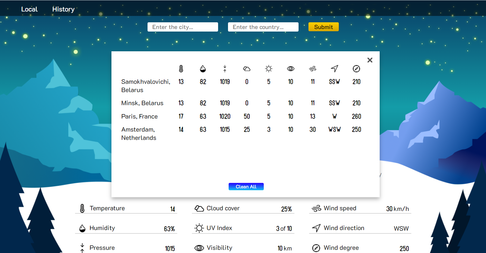

### Ваша задача усовершенствовать приложение по поиску погоды из предыдущего домашнего задания
---
Схематично приложение должно выглядеть следующим образом:

- добавьте кнопку `My weather`, по клику на которую вы будете получать погоду по текущему местоположению (используя `navigator.geolocation` получить координаты и сделать запрос);
- сохраняйте полученные данные в `localstorage` и отображайте их в итоговой таблице (можно сделать отдельным модальным окном - на ваше усмотрение);
- приложение должно обновлять значения в таблице, если такой город уже существет (не дублировать значения поиска);
- добавьте кнопку `Clear` для очистки данных из таблицы и `localstorage`;
---
- попробуйте использовать другие фичи из API - [документация](https://weatherstack.com/documentation) и добавить их в ваше приложение (например прогноз погоды на след дни, прогноз погоды за прошедшие дня - по введенной дате, и т.д.);
---
Один из вариантов готового приложения:

Таблица последних поисков:

**Дизайн приложения абсолютно на ваш вкус, проявите фантазию 😊**
