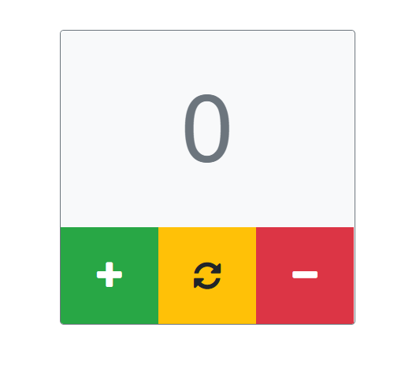
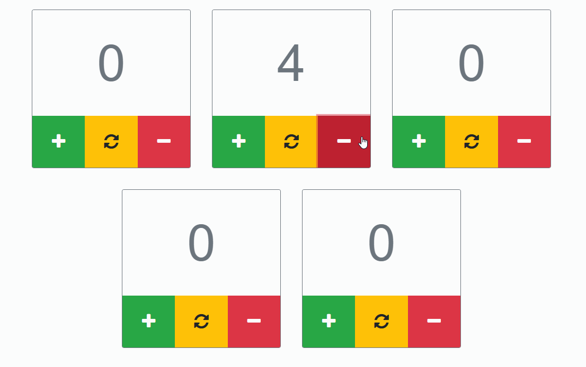

### Clicker
---
Your homework is to create a simple clicker using React.

Steps to implement:
- initialize your working directory (you could create a project using `create-react-app` or tune it by yourself with `webpack` and `babel`);
- you should have one entry point `index.js` , where you should call the `ReactDOM.render`;
- create a component, which should look similar to next image: 
 
- when pressing the `+` button it should increment a counter;
- when pressing the `-` button it should decrement a counter;
- when pressing the `reload` button it should discard a counter to `0`;
---
The `Clicker` component should be reusable! That means we could paste it many times and it should work independently.
Here is the final example:

---
[Homework guidelines](../homework-guidelines.md)