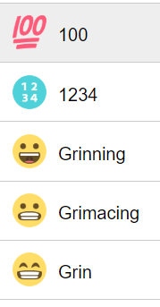
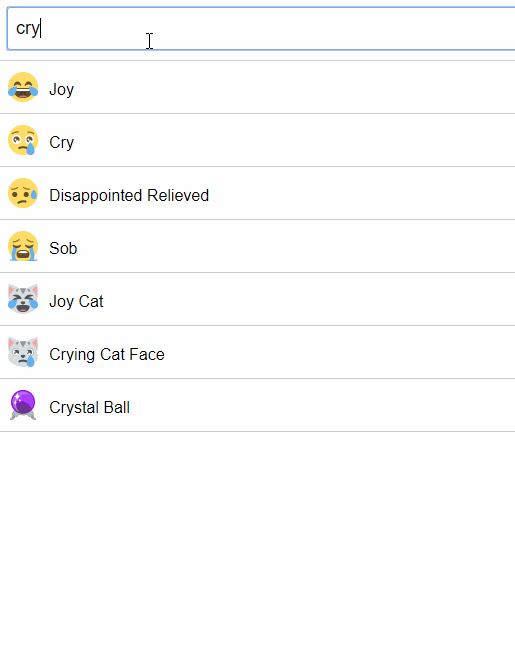

### Emoji
---
You should implement an emoji search based on [json](./emojiList.json)

Steps to implement:
- initialize your working directory (you could create a project using `create-react-app` or tune it by yourself with `webpack` and `babel`);
- you should have one entry point `index.js` , where you should call the `ReactDOM.render`;
- you should have a `Form` component, which accepts an emoji name;
- you should have an `EmojiCOntainer` component, which should render `EmojiRow` component;
- the `EmojiRow` should have a title and an emoji icon: 

    
    + you could just render a standard icon;
    + you could fetch a png icon from CDN  (use the next path: `//cdn.jsdelivr.net/emojione/assets/png/${codePointHex}.png`, where `codePointHex` is `symbol.codePointAt(0).toString(16)`)
- DO NOT RENDER MORE THAN 15 ROWS ON THE PAGE! (always limit your range);
---
Here is the final example:

---
[Homework guidelines](../homework-guidelines.md)