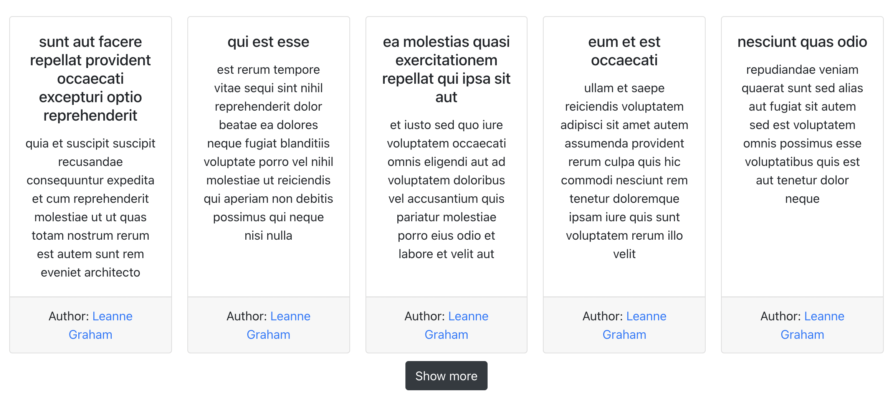
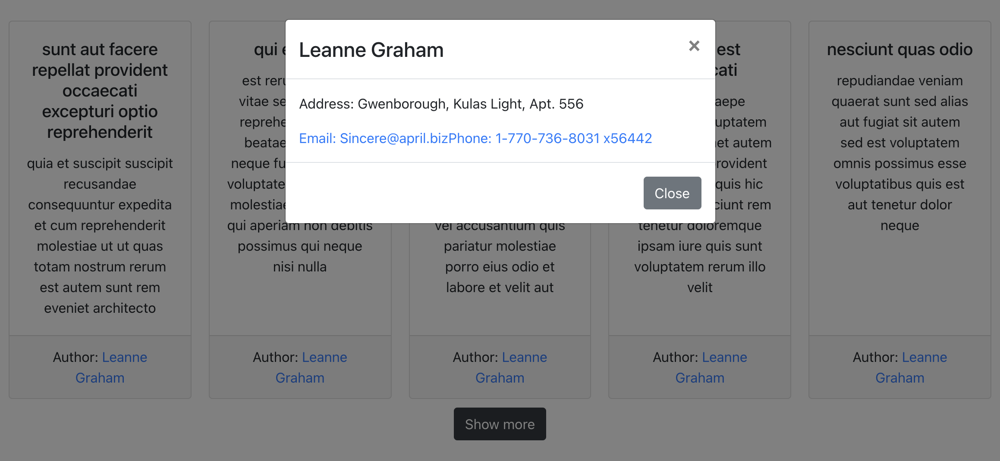
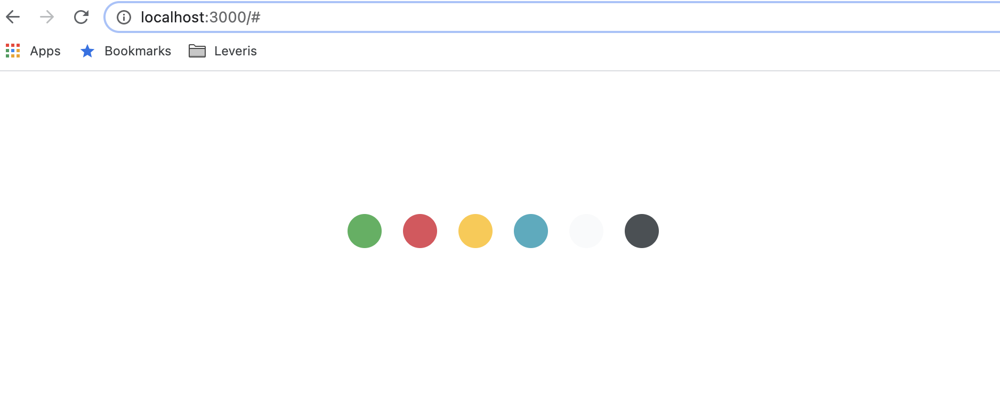

### Posts by users

---

Реализуйте приложение по отображению постов со следующего ендпоинта: https://jsonplaceholder.typicode.com/posts .
Используйте функциональные компоненты, `useState`, `useEffect`, `useCallback`.
В качестве компонентов можете использовать готовые решения от [react-bootstrap](https://react-bootstrap.github.io/) либо [material-ui](https://material-ui.com/)

Найти юзера - автора поста - можно по ключу поста `userId` в следующем эндпоинте: https://jsonplaceholder.typicode.com/users

Отображение постов:

  

При нажатии на автора поста появляется модально окно с инфо:

  

При загрузке страницы постов появляется лоадинг бар (при медленном интернет соединении будет долго виден):

  
