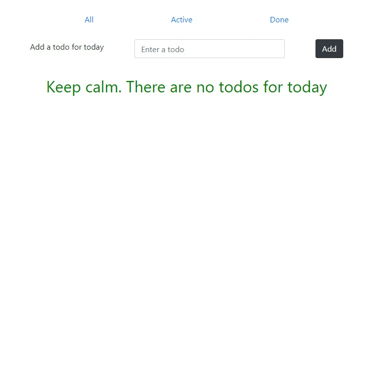

### Your homework is to create a simple todo app ✅
---
- create a branch `todo-app` from `master`;
- create a `todo-app` folder inside your homework's folder (if you are using `create-react-app` do it with `npx` command);
- your `src` folder structure should have `components`, `containers`, `state-management`, `helpers` folders and should look like: 
- the `state-management` folder should contain `actions`, `reducers`, `constants` folders, it also should have an `inex.js` file with combined reducers: 
- create reusable components in `components` folder;
- create `containers` using `connect()` from `react-redux`;
- your app should have the next requirements: 
    - adding a todo with `Form` component;
    - listing todos under the form;
    - a todo should have a `delete` and toggle `done` buttons;
    - there should be a possibility to render `all` todos, only `done` todos and only `active` todos
    ---
    ##### Optional requirements
    - use [`styled-components`](https://www.styled-components.com/) 💅 for styling;
    - use a `localstorage` to save your state;
    - use a [`react-router-dom`](https://reacttraining.com/react-router/web/guides/philosophy) for routing;
    ---
- create a pull request, add me as a reviewer;
- attach a gif record of your working app to a PR description;
---
### Final example
