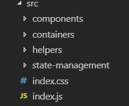
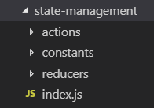

1. ✅ [Getting Started with Redux](https://egghead.io/courses/getting-started-with-redux) - очень хороший курс по Redux от создателя билиотеки - Дэна Абрамова

2. ### ✅ Создайте простой **TODO**-лист
---
- создайте новую ветку `todo-app` от ветки `master`;
- создайте папку `todo-app` в корне папки со всеми работами и выполняйте домашку в этой папке;
- папка `src` должна содержать папки `components`, `containers`, `state-management`, `helpers` и структура должна выглядеть следующим образом: 

    

- папка `state-management` должна содержать папки `actions`, `reducers`, `constants` ф также файл `inex.js`, где будут находиться ваши `combined reducers`: 

    

- в папке `components` должны лежать React компоненты, которые переиспользуются в проекте и не имеют прямого отношения к `redux store`;
- в папке `containers` должны лежать компонеты, которые знают про `store`, к которому подключаются с помощью функции `connect()` из библиотеки `react-redux`;
- ваше приложение должно выполнять следующие функции: 
    - добавление `todo` с помощью компоненты `Form`;
    - отображение списка ваших `todo`шек;
    - каждая `todo`шка должна иметь кнопки `delete` и `done` (кнопка `done` должна работать также как отмена действия);
    - должна быть возможность отображать `all` все тудушки, только `done` выполненные и только `active` активные;
    ---
    ##### Опционально:
    - используйте библиотеку [`styled-components`](https://www.styled-components.com/) 💅 для стилей;
    - используйте `localstorage` чтобы сохранять состояние приложения;
    - используйте библиотеку [`react-router-dom`](https://reacttraining.com/react-router/web/guides/philosophy) для роутинга (например страницы `all`, `done`, `active`, `not found`);
    ---
- создайте пул реквест, добавьте ментора в ревью;
- в описании пул реквеста добавьте скриншот или gif вашего приложения;
---
### Как может выглядеть ваше приложение:

